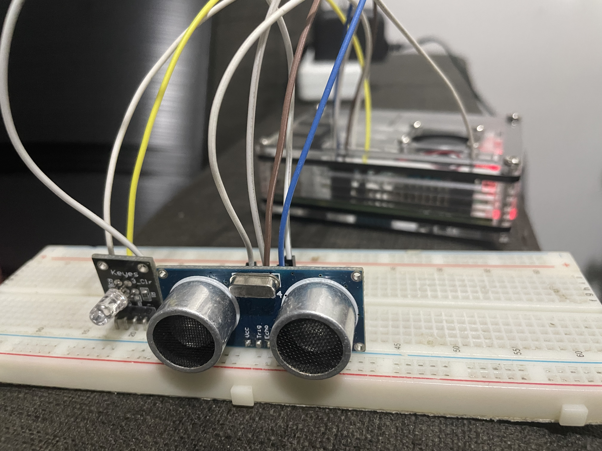

# Electronics with Raspberry pi
This a project that utilzes the raspberry pi gpio pins to control electronics

# Features
- Using a distance sensor to get accurate measure of distance in centimeters
- Taking the values of the distance sensor and controlling the rgb led with it
